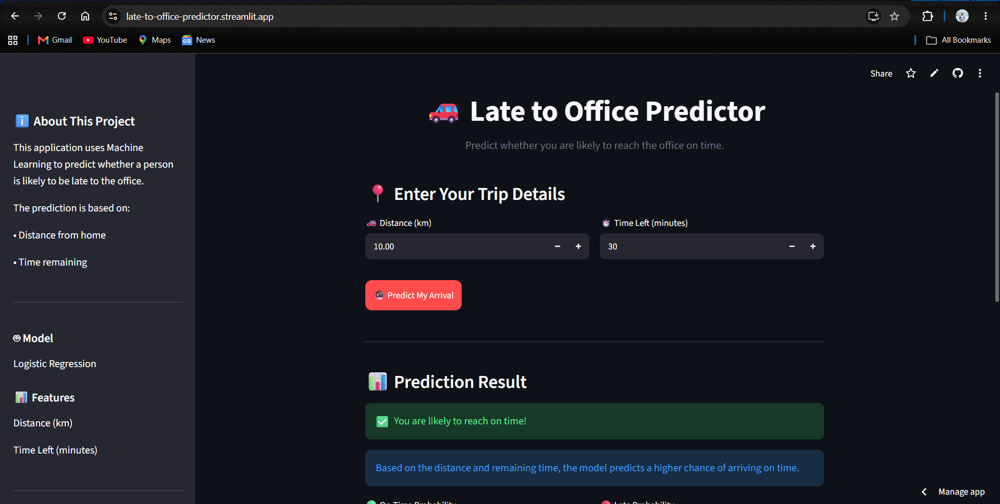
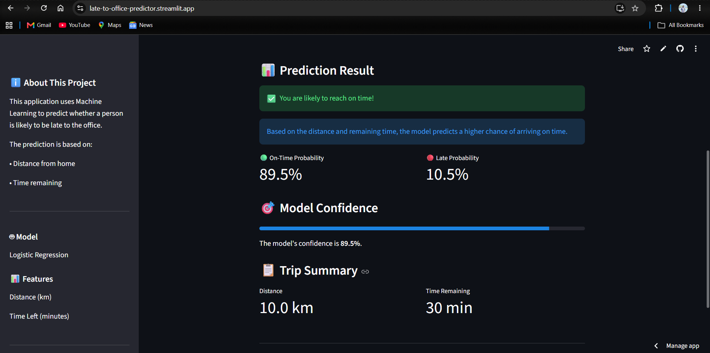

🚗 Late to Office Predictor

[Python] [Streamlit] [Scikit-learn] [GitHub]

A Machine Learning web application...

🌐 Live Demo

🚀 **[Open the Late to Office Predictor](https://late-to-office-predictor.streamlit.app/)**

## 📸 Application Preview




---

## 📌 About the Project

The **Late to Office Predictor** is a Machine Learning application that predicts whether a person is likely to reach the office on time.

The prediction is based on two factors:

- 🚗 Distance from home to office
- ⏱️ Time remaining before the deadline

The application provides:

- ✅ On-Time prediction
- ⚠️ Late prediction
- 📊 On-Time probability
- 📊 Late probability
- 🎯 Prediction confidence
- 🖥️ Interactive Streamlit interface

---

## 🧠 Machine Learning

The main Machine Learning model used in this project is:

### Logistic Regression

A **Decision Tree Classifier** is also trained for comparison.

### Model Accuracy

| Model | Accuracy |
|:---|---:|
| Logistic Regression | **99.33%** |
| Decision Tree | **99.67%** |

---

## 📊 Dataset

The dataset contains **1,000 balanced samples**.

| Class | Number of Samples |
|:---|---:|
| 🟢 On Time | 500 |
| 🔴 Late | 500 |
| **Total** | **1,000** |

### Features

| Feature | Description |
|:---|:---|
| `distance_km` | Distance from home to office in kilometers |
| `time_left_minutes` | Time remaining before the deadline |
| `will_be_late` | Target variable |

### Target Values

| Value | Meaning |
|:---:|:---|
| `0` | 🟢 On Time |
| `1` | 🔴 Late |

---

## 🛠️ Technologies Used

- 🐍 Python
- 🐼 Pandas
- 🔢 NumPy
- 🤖 Scikit-learn
- 📦 Joblib
- 🎈 Streamlit
- 🔧 Git
- 🐙 GitHub

---

## 🔄 Machine Learning Workflow

```text
Dataset
   ↓
Data Preprocessing
   ↓
Train-Test Split
   ↓
Feature Scaling
   ↓
Logistic Regression
   ↓
Model Evaluation
   ↓
Model Saving
   ↓
Streamlit Application
   ↓
Streamlit Cloud Deployment

```text
Dataset
   ↓
Data Preprocessing
   ↓
Train-Test Split
   ↓
Feature Scaling
   ↓
Logistic Regression
   ↓
Model Evaluation
   ↓
Model Saving
   ↓
Streamlit Application
   ↓
Streamlit Cloud Deployment
```

---

## 📁 Project Structure

```text
LATE/
│
├── app.py
├── train_model.py
│
├── late_to_office_dataset.csv
├── late_to_office_model.pkl
├── scaler.pkl
│
├── requirements.txt
├── README.md
├── .gitignore
│
├── Late.ipynb
└── Late_Cleaned.ipynb
```

---

## 💻 Run the Project Locally

### 1. Clone the repository

```bash
git clone https://github.com/MANI-11102004/late-to-office-predictor.git
```

### 2. Open the project

```bash
cd late-to-office-predictor
```

### 3. Create a virtual environment

```bash
python -m venv .venv
```

### 4. Activate the environment

**Windows PowerShell:**

```powershell
.venv\Scripts\Activate.ps1
```

### 5. Install dependencies

```bash
pip install -r requirements.txt
```

### 6. Train the model

```bash
python train_model.py
```

### 7. Run the Streamlit application

```bash
streamlit run app.py
```

The application will open at:

**http://localhost:8501**

---

## 🚀 Deployment

The application is deployed using **Streamlit Community Cloud**.

### 🌐 Live Application

🚀 **[Open the Live Application](https://late-to-office-predictor.streamlit.app/)**

---

## 🔮 Future Improvements

Some possible future improvements are:

- 🚦 Traffic condition
- 🌧️ Weather condition
- 🚗 Average travel speed
- 📍 Real-time location
- 🗺️ Map integration
- 🤖 More advanced Machine Learning models
- 📱 Improved mobile interface

---

## 👨‍💻 Author

### Mani Shankar

AI/ML enthusiast interested in Machine Learning, Python, and Software Development.

---

⭐ **If you find this project useful, consider giving the repository a star!**